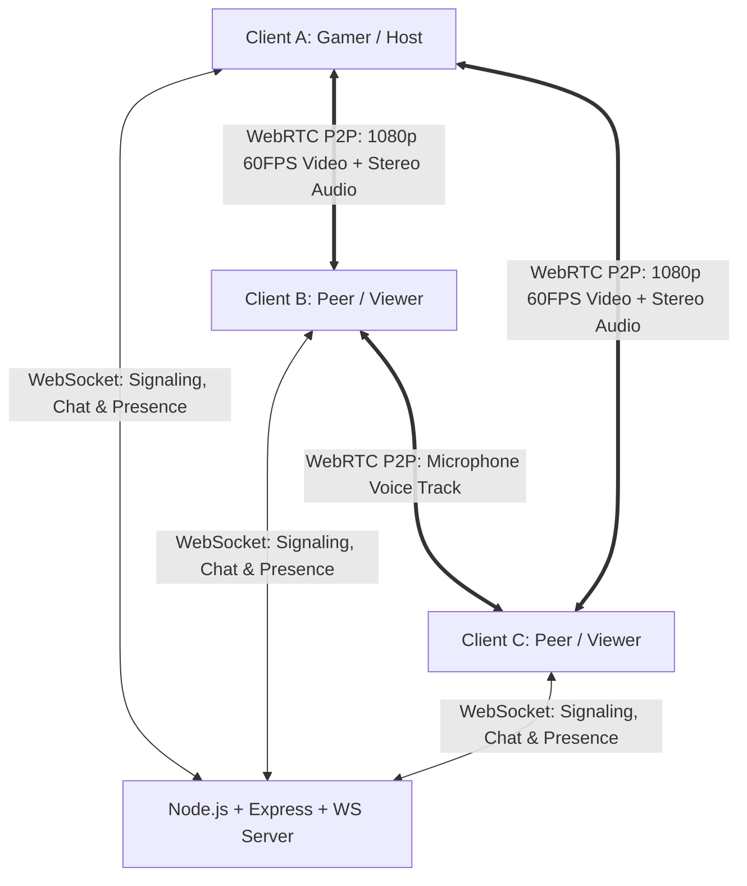

<div align="center">

# 🎮 DMG Live Share (`DMG-GOLIVE`)

### High-Performance P2P WebRTC Screen Sharing & Real-Time Voice Platform

[](https://opensource.org/licenses/MIT)
[](https://www.typescriptlang.org/)
[](https://react.dev/)
[](https://tailwindcss.com/)
[](https://nodejs.org/)
[](https://webrtc.org/)

<p align="center">
  <b>A lightweight, ultra-low latency alternative to Discord Go Live for gameplay streaming, movie co-watching, and voice communication.</b>
</p>

[🌐 Live App Demo](https://live.walacemendes.com.br) • [📁 Portfolio Hub](https://walacemendes.com.br) • [📖 Domain Setup Guide](TUTORIAL_DOMINIO.md) • [🚀 Deploy Guide](DEPLOY.md)

</div>

---

## ⚡ Overview

**DMG Live Share (`DMG-GOLIVE`)** is an open-source peer-to-peer screen sharing and voice platform built for gamers, streamers, and watch parties. It enables frictionless, broadcast-quality screen sharing up to **1080p/1440p @ 60 FPS** with **full stereo game/system audio capture**, synchronized microphone streams, real-time WebSocket chat, and secure authentication.

Designed as an integrated module of [walacemendes.com.br](https://walacemendes.com.br) running on the dedicated subdomain **`live.walacemendes.com.br`**.

---

## 🌟 Key Features

| Category | Highlights |
| :--- | :--- |
| **🚀 Real-Time WebRTC Media** | Mesh topology with STUN fallback (`<20ms` latency), hardware-accelerated video rendering, and motion-optimized display capture (`contentHint: motion`). |
| **🔊 Crystal-Clear Audio** | System/game stereo sound capture + low-latency microphone audio mixing with acoustic echo cancellation & background noise suppression. |
| **🔒 Secure Authentication** | Password hashing via **PBKDF2 with unique cryptographic salts**, HMAC-SHA256 session tokens, user profiles, and seamless **Guest Quick Access**. |
| **📺 Gaming Stage & Controls** | Multi-streamer switcher, individual stream volume sliders (0–150%), Picture-in-Picture (PiP), Fullscreen (F11), and 1-click gameplay snapshot capture. |
| **🎙️ Voice Activity Detection** | Real-time Web Audio API frequency analysis driving glowing speaking indicators on avatars and video cards. |
| **💬 WebSocket Room Engine** | Instant room creation, dynamic presence, message history retention (last 50 messages), and animated emoji reaction bursts. |
| **🌐 Flexible Deployment** | Native support for root `/` and subpath `/dmg-live-share`, ready for Nginx reverse proxies, Docker, Render, and Railway. |

---

## 🏗️ Architecture



### Protocol Flow:
1. **Handshake & Auth**: Client connects via WebSocket (`/ws` or `/dmg-live-share/ws`) with validated session token or guest credentials.
2. **Signaling Exchange**: SDP Offers, Answers, and ICE Candidates are routed in real-time through the lightweight Node.js relay.
3. **P2P Streaming**: Media tracks (screen video, screen audio, microphone) stream directly between browsers over encrypted SRTP/DTLS channels.

---

## 📦 Tech Stack

- **Frontend Core:** React 19, TypeScript 5.8, Vite 6, Tailwind CSS v4, Motion, Lucide Icons, Canvas Confetti.
- **Audio & Media:** Web Audio API (`AudioContext`, `AnalyserNode`), `navigator.mediaDevices.getDisplayMedia`, `RTCPeerConnection`.
- **Backend & Signaling:** Node.js, Express, `ws` (WebSocket), Native `node:crypto` PBKDF2/HMAC engine.
- **Tooling:** ESBuild, TSX.

---

## 🚀 Quickstart

### Prerequisites
- **Node.js**: v20.x or v22.x+
- **npm** or **bun** / **yarn**

### 1. Clone & Install Dependencies
```bash
git clone https://github.com/ualasimendes/DMG-GOLIVE.git
cd DMG-GOLIVE
npm install
```

### 2. Development Mode
```bash
npm run dev
```
Open [http://localhost:3000](http://localhost:3000) in your browser.

### 3. Production Build
```bash
# Build Vite frontend and bundle server
npm run build

# Start production server
npm start
```

---

## ⚙️ Environment Variables

Create a `.env` file in the root directory (see [.env.example](.env.example)):

| Variable | Type | Default | Description |
| :--- | :--- | :--- | :--- |
| `PORT` | `number` | `3000` | HTTP & WebSocket server port |
| `NODE_ENV` | `string` | `development` | `development` or `production` |
| `JWT_SECRET` | `string` | `dmg-liveshare-secret` | Cryptographic secret for signing session tokens |
| `VITE_BASE_PATH` | `string` | `./` | Base URL path for assets (e.g., `/dmg-live-share/` or `./`) |

---

## 🌐 Production & Nginx Configuration

For deploying under **`https://live.walacemendes.com.br`** on Ubuntu/Debian with Nginx:

```nginx
server {
    server_name live.walacemendes.com.br;

    location / {
        proxy_pass http://localhost:3000;
        proxy_http_version 1.1;
        proxy_set_header Upgrade $http_upgrade;
        proxy_set_header Connection "upgrade";
        proxy_set_header Host $host;
        proxy_set_header X-Real-IP $remote_addr;
        proxy_set_header X-Forwarded-For $proxy_add_x_forwarded_for;
        proxy_set_header X-Forwarded-Proto $scheme;
        proxy_cache_bypass $http_upgrade;
    }

    listen 80;
}
```

Enable HTTPS via Let's Encrypt / Certbot:
```bash
sudo certbot --nginx -d live.walacemendes.com.br
```

---

## 📚 Documentation & Guides

- [**TUTORIAL_DOMINIO.md**](TUTORIAL_DOMINIO.md) — Step-by-step DNS setup for `live.walacemendes.com.br` and integration with the main portfolio "Aba Projetos".
- [**DEPLOY.md**](DEPLOY.md) — Comprehensive server deployment instructions (VPS, Render, Railway, PM2).

---

## 📄 License

This project is licensed under the **MIT License** — see the [LICENSE](LICENSE) file for details.

---

<div align="center">
  <sub>Developed by <a href="https://walacemendes.com.br">Walace Mendes</a> • Built for gaming parties and seamless screen sharing</sub>
</div>
